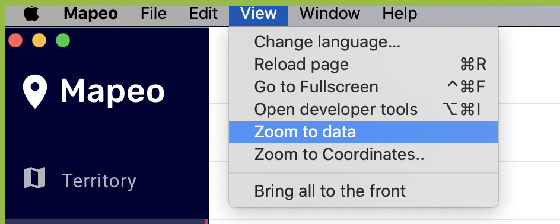
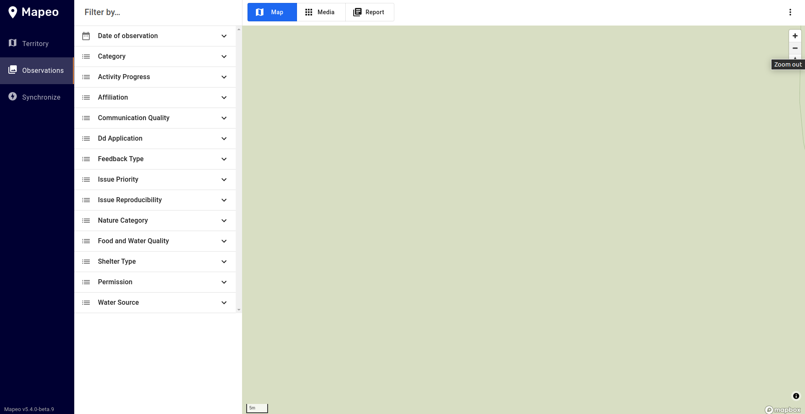
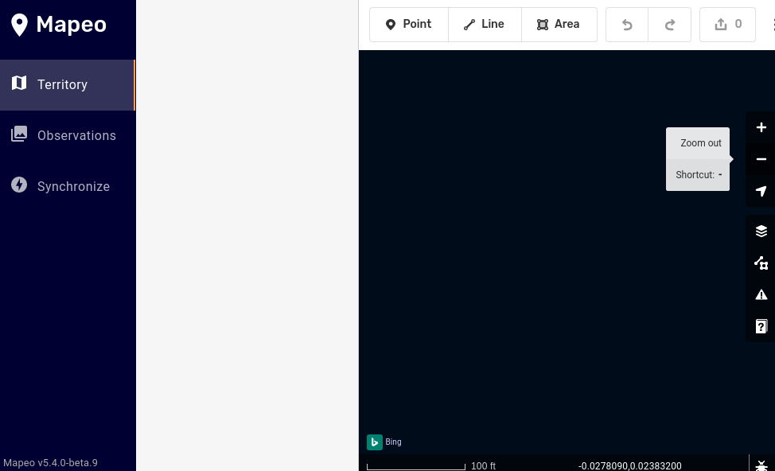
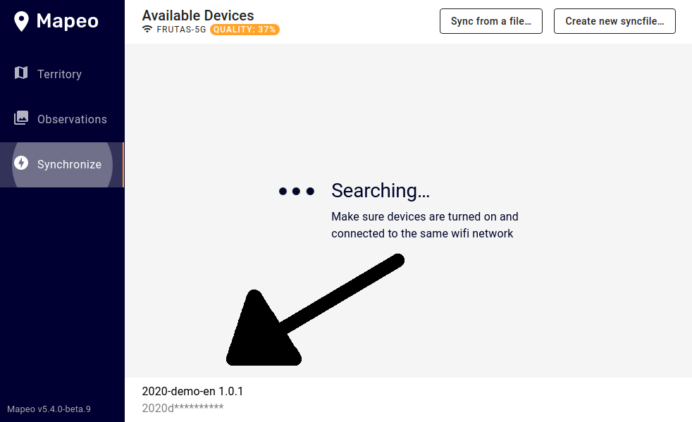

# Frequently Asked Questions

## What happens if Mapeo loses financial support? **Will my data be inaccessible?**

Mapeo is built with long-term sustainability as a focus. This goes beyond financial sustainability -- we ensure that no single entity or technology is responsible for data storage or access. 

Mapeo does not lock ****your data into a particular data format. You can easily move your data around, and it's kept in it's original form. Mapeo can export data to [SMART](http://smartconservationtools.org/download/), Shapefile, CSV, and GeoJSON.  You'll never be locked into using Mapeo software.

## I can't see my observations on the map

If you are seeing a blank or biege screen, ensure that you are zoomed out. Use the Minus \(-\) sign on the top right hand corner of the map to zoom out as far as possible. When you've zoomed out to see the entire world, you'll be able to see your data.

To more quickly get access to your data, you can also use the Zoom to Data feature found in the application menubar, under View-&gt;Zoom to data.

## I ran into an error. What do I do?

If you see an error message in Mapeo, please open a bug report on GitHub, or contact us in our support channels.



## **I'm having trouble synchronizing my data!**

Make sure your Mapeo applications are on the latest stable versions, [downloaded from the Mapeo website](https://mapeo.world/) or Google Play. 

Ensure that all devices are using the same configuration and project key. You can determine this by looking at the bottom of the syncronization screen in Desktop;

And the Observations-&gt;Settings-&gt;Project Configuration screen on mobile.

If you continue to have issues, [please let us know and get support from our technical team.](get-support.md)

## Does Mapeo use a Blockchain?

Mapeo uses secure peer-to-peer technology with a distributed ledger, which does not include a public blockchain or consensus. 

Public blockchains are designed for a scenario where public transactions must be mediated between participants which are all potentially malicious. These “trustless” transactions are the key assumption of a blockchain that distinguishes it from peer-to-peer technology. 

Applications like Mapeo assume that data is managed by the community generating it -- and **some of that data may never be publicly accessible.** Mapeo's approach, in contrast, creates a closed group, where data creators are also data stewards, managing their own data and controlling who has access. We take security seriously and maintain protections from third-party attacks such as targeted hacks and surveillance by third-parties. For users of Mapeo, privacy is critical for protecting their ancestral knowledge and environmental monitoring information  until it’s ready to be shared with trusted partners. 

For more information, [read this blog post](https://www.digital-democracy.org/blog/blockchain/) and [this paper from Article 19](https://www.article19.org/resources/blockchain-technology-alone-cannot-protect-freedom-of-expression) about why blockchain is not a recommended tool for human rights and freedom of expression.

## 

